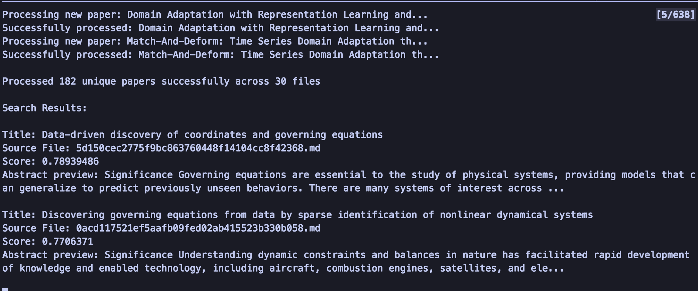

# PaperBrain

PaperBrain is an intelligent research paper Q&A system that combines vector search and large language models to provide context-aware answers to research-related questions. It processes academic papers, understands their content, and generates structured, informative responses with proper citations and context.

#### AI Response


## ✨ Key Features

### Core Capabilities

- **Smart Vector Search**: Utilizes Qdrant for semantic similarity search of research papers
- **Intelligent Analysis**: Leverages LLaMA 3.2 for generating comprehensive, context-aware answers
- **Structured Responses**: Provides organized output with:
  - Main answer summary
  - Key points from papers
  - Paper citations and references
  - Analysis limitations
- **Duplicate Detection**: Intelligent tracking of shown papers to avoid repetition

#### Paper Citations


#### Paper Keybopints


### Advanced Features

- **Analytics Dashboard**: Track system usage, search patterns, and relevance metrics
- **Conversation History**: Maintain records of previous queries and responses
- **Relevance Scoring**: Clear explanation of paper matching with detailed relevance metrics
- **Interactive Commands**: System controls for analytics, history, and paper tracking

## 🛠️ Technology Stack

- **Vector Store**: Qdrant for efficient similarity search
- **Embeddings**: Nomic Embed Text for paper vectorization
- **LLM Integration**: LLaMA 3.2 (1B parameter model) via Ollama
- **Infrastructure**: Docker containerization
- **Backend**: Async Python with modern libraries
- **API Layer**: Async HTTP with HTTPX

#### Qdrant Database


#### Markdown to Vectors



## 📋 Prerequisites

```bash
# System requirements
- Python 3.9+
- Docker
- 4GB+ RAM for LLM operations
- Disk space for paper storage
```

## Installation

1. Clone the repository:

```bash
git clone https://github.com/ansh-info/PaperBrain.git
cd PaperBrain
```

2. Create a virtual environment:

```bash
# Using conda
conda create --name PaperBrain python=3.11
conda activate PaperBrain

# Using venv
python -m venv env
source env/bin/activate  # On Windows: .\env\Scripts\activate
```

3. Install dependencies:

```bash
pip install -r requirements.txt
```

4. Start required services:

```bash
docker-compose up -d
```

5. Pull required models:

```bash
# If you want other models
docker exec ollama ollama pull llama3.2:1b
docker exec -it ollama ollama pull mistral
docker exec -it ollama ollama pull nomic-embed-text
```

## 💻 Usage

### Paper Ingestion

```bash
python src/vector.py
```

- Place your markdown files in the `markdowns/` directory
- System automatically processes and indexes papers
- Handles duplicate detection and tracking

### Query Interface

```bash
python src/llmquery.py     #Run src/query.py to query qdrant database(without llm)
```

### Available Commands

- `quit` or `q`: Exit the program
- `analytics`: Display system usage statistics
- `clear`: Reset paper history
- `history`: View recent questions and responses

### Example Query Flow

```
> What are the main approaches for discovering governing equations from data?

The system will provide:
1. Main Answer: Comprehensive summary
2. Key Points: Important findings
3. Paper Citations: Relevant sources
4. Limitations: Gaps in current knowledge
5. Relevance Scores: Why papers were selected
```

#### Relevant Papers


## 📁 Project Structure

```
research-lens/
├── docker-compose.yml
├── requirements.txt
├── README.md
├── vector.py      # Paper ingestion and processing
├── llmquery.py          # Main Q&A interface
├── query.py          # To query qdrant databse without llm
├── markdowns/     # Paper storage directory
└── processed_papers.json # Paper tracking database
```

## ⚙️ Configuration

Environment variables for system configuration:

```bash
QDRANT_HOST=localhost    # Qdrant server host
QDRANT_PORT=6333        # Qdrant server port
OLLAMA_HOST=localhost   # Ollama server host
OLLAMA_PORT=11434      # Ollama server port
```

## 🔄 Processing Pipeline

1. **Paper Ingestion**:

   - Reads markdown files from recommendations directory
   - Generates embeddings using Nomic Embed Text
   - Stores vectors and metadata in Qdrant
   - Tracks processed papers to avoid duplicates

2. **Query Processing**:

   - Converts user query to vector
   - Performs similarity search
   - Retrieves relevant papers
   - Generates structured LLM response

3. **Response Generation**:
   - Formats context for LLM
   - Generates structured response
   - Provides relevance explanations
   - Maintains conversation history

## 🎯 Future Roadmap

- [ ] Export functionality (PDF, markdown)
- [ ] Advanced paper filtering options
- [ ] Citation network visualization
- [ ] Multi-language support
- [ ] Batch processing capabilities
- [ ] API interface for integration
- [ ] Enhanced analytics dashboard
- [ ] Custom prompt templates

## 🤝 Contributing

Contributions are welcome! Please:

1. Fork the repository
2. Create your feature branch (`git checkout -b feature/amazing-feature`)
3. Commit your changes (`git commit -m 'Add amazing feature'`)
4. Push to the branch (`git push origin feature/amazing-feature`)
5. Open a Pull Request

## 📄 License

This project is licensed under the MIT License - see the [LICENSE](LICENSE) file for details.

## 🙏 Acknowledgments

- Qdrant team for vector database
- Ollama project for LLM interface
- Nomic AI for embedding model
- LLaMA team for the base model
- The Markdowns were fetched using [literatureSurvey](https://github.com/VirtualPatientEngine/literatureSurvey)

## 💡 Citation

If you use this project in your research, please cite:

```bibtex
@software{PaperBrain_2024,
  author = {Ansh Kumar and Apoorva Gupta},
  title = {PaperBrain: Intelligent Research Paper Q&A System},
  year = {2024},
  url = {https://github.com/ansh-info/PaperBrain}
}
```
